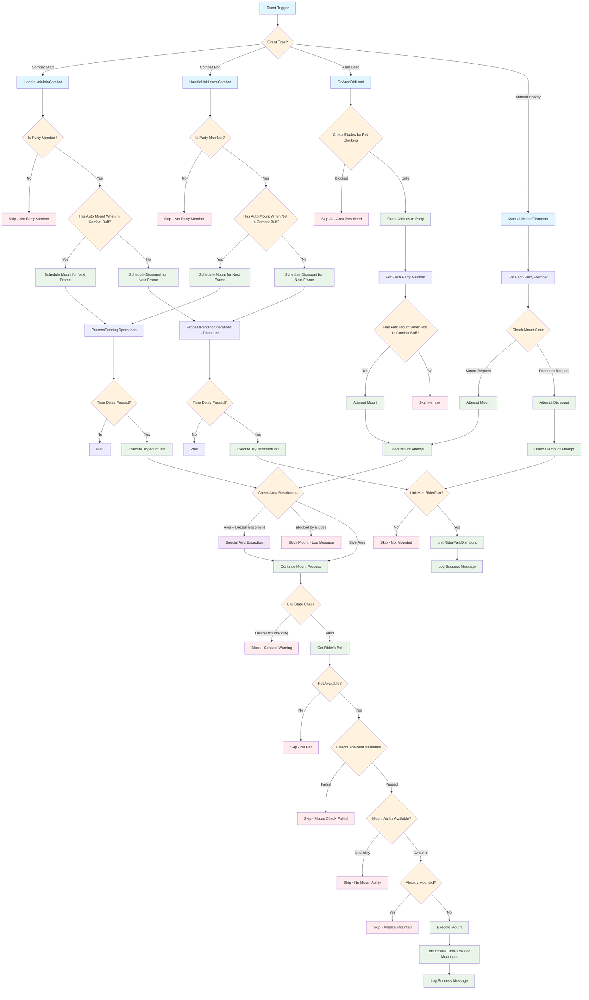
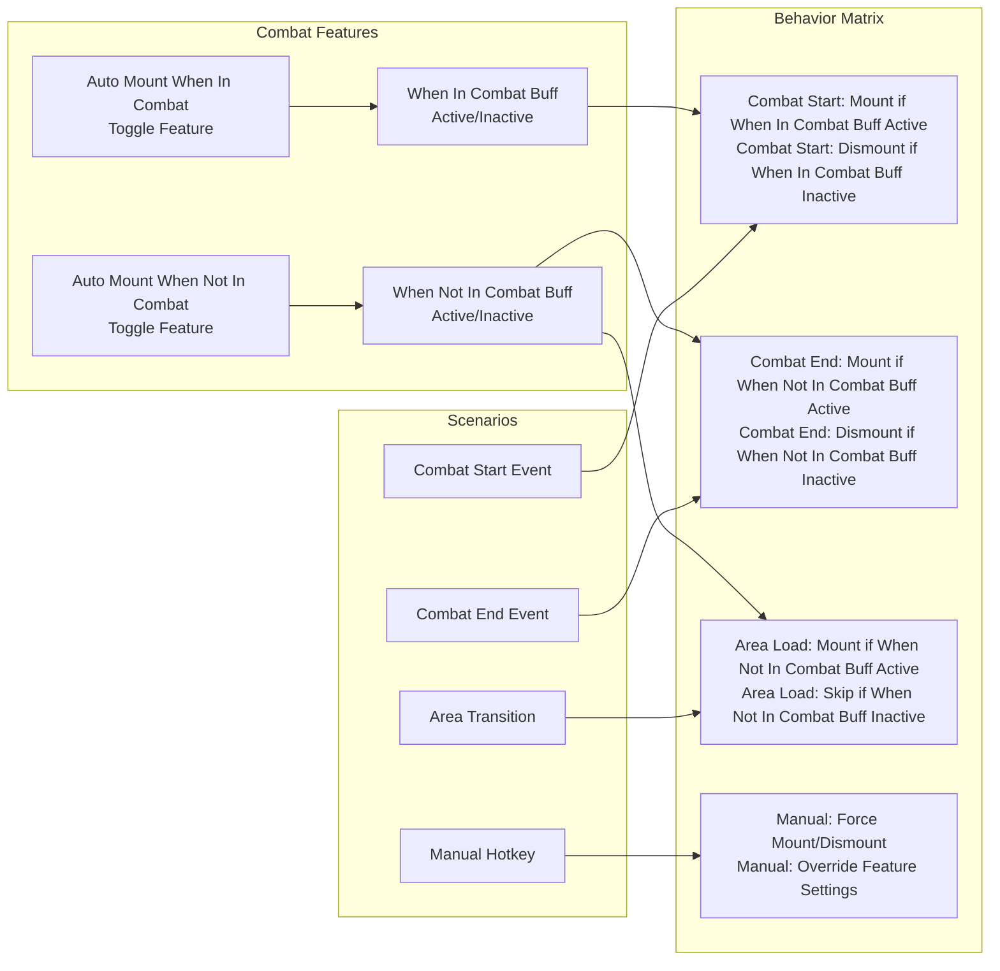
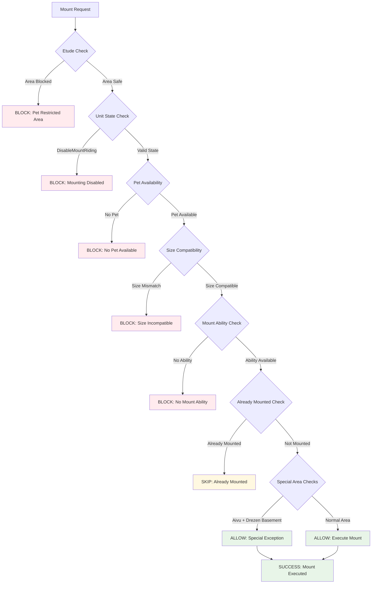
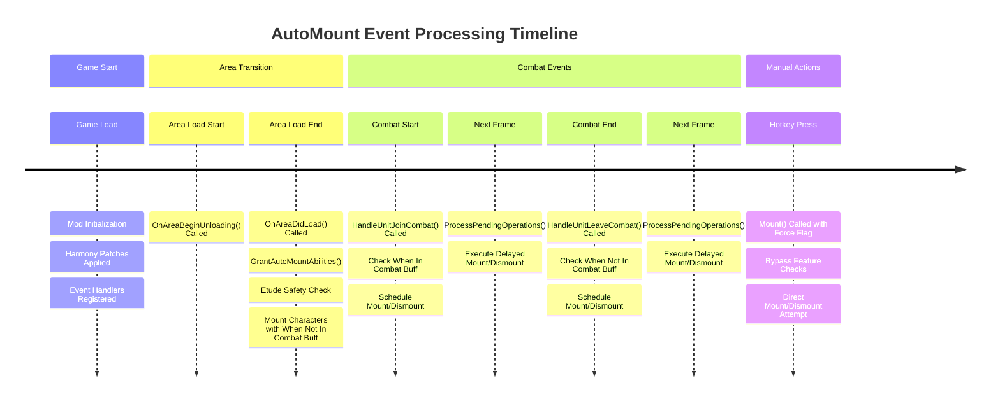

# AutoMount Logic Flow Documentation

This document provides a comprehensive overview of the AutoMount system's logic flow, showing how mounting is handled across different scenarios with the two combat features.

## System Overview

The AutoMount system has two main automated mounting features:
1. **Auto Mount When In Combat** - Stay mounted while in combat
2. **Auto Mount When Not In Combat** - Stay mounted while not in combat (including area transitions)

## Main Logic Flow

## Feature Interaction Matrix

## Safety Checks and Validation Flow

## Event Processing Timeline

## Error Handling and Edge Cases

### Special Handling Cases:

1. **Aivu Exception**: Special case for Drezen basement area where Aivu can mount despite area restrictions
2. **Size Validation**: Checks mount size compatibility with TTT Undersized Mount feat support
3. **Combat Delays**: 0.1 second delay on combat events to avoid event system conflicts
4. **Area Etude Blocks**: Dynamic area detection that prevents mounting in problematic areas
5. **Party Member Validation**: Only processes party members, ignores NPCs and enemies

### Error Recovery:
- All mount/dismount operations are wrapped in try-catch blocks
- Failed operations are logged and removed from pending queues
- Invalid units are skipped with appropriate debug logging
- Missing abilities or features are detected and logged

### Feature Interaction:
- Auto Mount When In Combat and Auto Mount When Not In Combat features are independent
- Area load only respects Auto Mount When Not In Combat feature settings
- Manual hotkeys override all automatic feature settings
- Each character can have different feature preferences